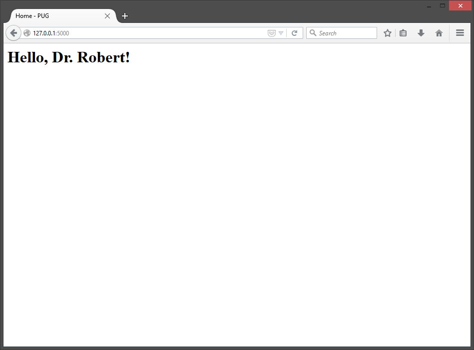

# 2015 PUG - Flask Data Visualization
## Goddard Python Users Group Meeting 
## Oct. 6 - Building 34, Room W120B, 10:00AM - 11:00AM

Python, Flask, and Web-visualizations

<h2>[Talk Slides](http://jakebrinkmann.github.io/2015-PUG-flask-data-vis)</h2>

Welcome, [Goddard Python User's Group](https://lists.nasa.gov/mailman/listinfo/gsfc-python-users)!  

This is the web application we wrote for data visualization in [Python](http://python.org/) using the [Flask](http://flask.pocoo.org/) microframework.

A live version of the final website: [http://jakebrinkmann.pythonanywhere.com/](http://jakebrinkmann.pythonanywhere.com/)

## Install

Recommended to install using `git`:

    git clone https://github.com/jakebrinkmann/2015-PUG-flask-data-vis.git
    cd 2015-PUG-flask-data-vis
    pip install requirements.txt
    python run.py

An alternative would be to use `wget`:

    wget "https://github.com/jakebrinkmann/2015-PUG-flask-data-vis/archive/master.zip"
    unzip master.zip
    cd 2015-PUG-flask-data-vis
    pip install requirements.txt
    python run.py

