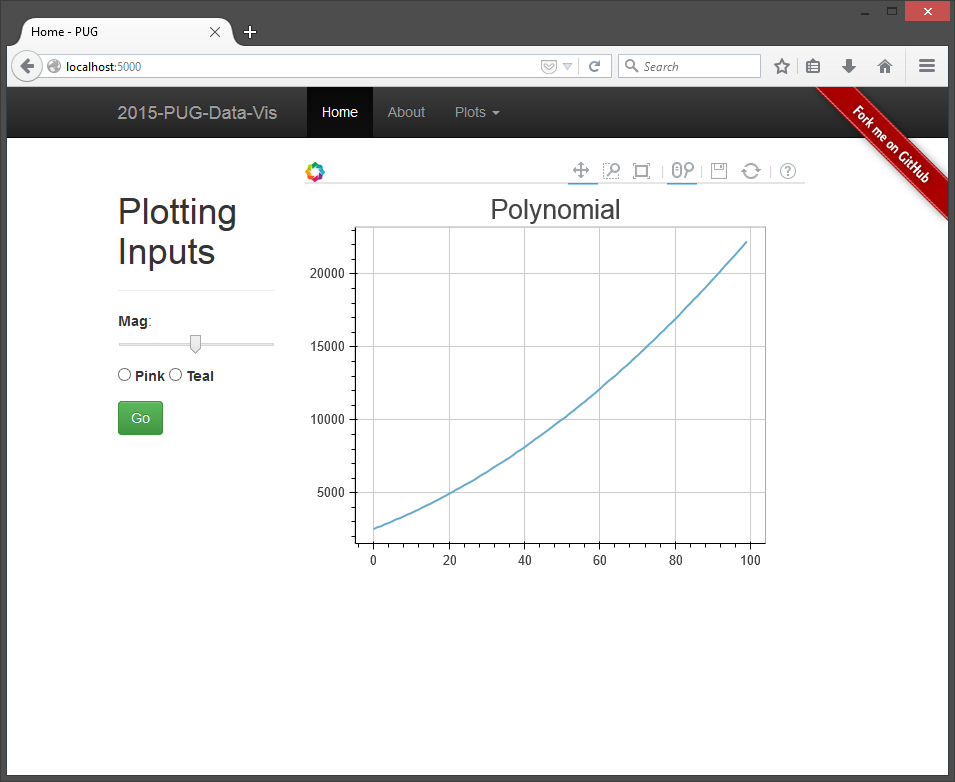

# 2015 PUG - Flask Data Visualization

Python, Flask, and Web-visualizations

# GSFC PUG - OCT 2015

Welcome, [Goddard Python User's Group](https://lists.nasa.gov/mailman/listinfo/gsfc-python-users)!  

This guide outlines the steps we took in our **October 6th, 2015 Meetup** to write a web application, for data visualization, in [Python](http://python.org/) using the [Flask](http://flask.pocoo.org/) microframework.

To follow along, please find my <h3>[slides here](http://jakebrinkmann.github.io/2015-PUG-flask-data-vis)</h3>.  
A live version of the final website: [http://jakebrinkmann.pythonanywhere.com/](http://jakebrinkmann.pythonanywhere.com/)

## Install

Recommended to install using `git`:

    git clone https://github.com/jakebrinkmann/2015-PUG-flask-data-vis.git
    cd 2015-PUG-flask-data-vis
    pip install requirements.txt
    python run.py

An alternative would be to use `wget`:

    wget "https://github.com/jakebrinkmann/2015-PUG-flask-data-vis/archive/master.zip"
    unzip master.zip
    cd 2015-PUG-flask-data-vis
    pip install requirements.txt
    python run.py

